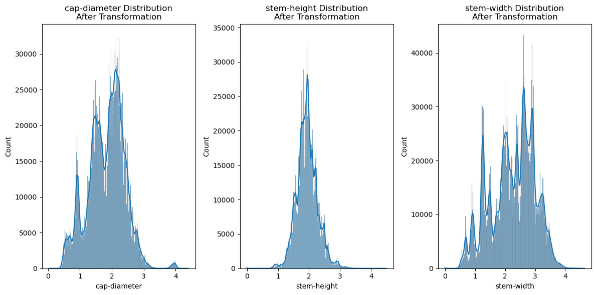

# Binary_Prediction_of_Poisonous_Mushrooms

# Importing Libraries and Dataset


```python
import pandas as pd
import numpy as np
from sklearn.model_selection import train_test_split
from sklearn.impute import SimpleImputer
from sklearn.preprocessing import OneHotEncoder, StandardScaler, MinMaxScaler
from sklearn.compose import ColumnTransformer
from sklearn.ensemble import VotingClassifier
from sklearn.metrics import f1_score, matthews_corrcoef
from sklearn.pipeline import Pipeline
from sklearn.model_selection import cross_val_score
import matplotlib.pyplot as plt
import seaborn as sns
```


```python
# Preprocessing
df_train = pd.read_csv(r"C:\Users\ACER\Downloads\playground-series-s4e8\train.csv", index_col='id')
df_test = pd.read_csv(r"C:\Users\ACER\Downloads\playground-series-s4e8\test.csv", index_col='id')

df_train.drop(columns=['veil-type', 'spore-print-color', 'stem-root', 'veil-color', 'stem-surface'], inplace=True)
df_test.drop(columns=['veil-type', 'spore-print-color', 'stem-root', 'veil-color', 'stem-surface'], inplace=True)
```


```python
numerical_feature = ['cap-diameter', 'stem-height', 'stem-width']
categorical_feature = ['cap-shape', 'cap-surface', 'cap-color', 'does-bruise-or-bleed', 
                      'gill-attachment', 'gill-spacing', 'gill-color', 'stem-color', 
                      'has-ring', 'ring-type', 'habitat', 'season']
```

# Preprocessing and Data Splitting


```python
# Label Encoding target variable
from sklearn.preprocessing import LabelEncoder
le = LabelEncoder()
df_train['class'] = le.fit_transform(df_train['class'])
```


```python
# Handle infrequent categories
def replace_infrequent_categories(df, column, threshold=70):
    value_counts = df[column].value_counts()
    infrequent = value_counts[value_counts <= threshold].index
    df[column] = df[column].apply(lambda x: "Unknown" if x in infrequent else x)
    return df

for col in categorical_feature:
    df_train = replace_infrequent_categories(df_train, col)
    df_test = replace_infrequent_categories(df_test, col)
```


```python
def handle_skewness(df, threshold=1.0):
    numeric_cols = df.select_dtypes(include=['number']).columns
    lambda_dict = {}
    
    for col in numeric_cols:
        skewness = df[col].skew()
        if skewness > threshold:
            df[col] = df[col] + 1  # Shift data to positive
            df[col] = np.log(df[col])
            lambda_dict[col] = 'log'
    
    return df, lambda_dict

# Apply skewness handling to train and test sets
df_train, lambda_values_train = handle_skewness(df_train)
df_test, lambda_values_test = handle_skewness(df_test)

```


```python
# Visualize skewness before and after transformation
def plot_skewness(df, title):
    plt.figure(figsize=(12, 6))
    for i, col in enumerate(df.select_dtypes(include=['number']).columns, 1):
        plt.subplot(1, len(df.select_dtypes(include=['number']).columns), i)
        sns.histplot(df[col], kde=True)
        plt.title(f'{col} Distribution\n{title}')
    plt.tight_layout()
    plt.show()
```


```python
# After transformation
plot_skewness(df_train[numerical_feature], "After Transformation")
```

    D:\anaconda3\Lib\site-packages\seaborn\_oldcore.py:1119: FutureWarning: use_inf_as_na option is deprecated and will be removed in a future version. Convert inf values to NaN before operating instead.
      with pd.option_context('mode.use_inf_as_na', True):
    D:\anaconda3\Lib\site-packages\seaborn\_oldcore.py:1119: FutureWarning: use_inf_as_na option is deprecated and will be removed in a future version. Convert inf values to NaN before operating instead.
      with pd.option_context('mode.use_inf_as_na', True):
    D:\anaconda3\Lib\site-packages\seaborn\_oldcore.py:1119: FutureWarning: use_inf_as_na option is deprecated and will be removed in a future version. Convert inf values to NaN before operating instead.
      with pd.option_context('mode.use_inf_as_na', True):
    


    

    


```python
# After transformation
plot_skewness(df_test[numerical_feature], "After Transformation")
```

    D:\anaconda3\Lib\site-packages\seaborn\_oldcore.py:1119: FutureWarning: use_inf_as_na option is deprecated and will be removed in a future version. Convert inf values to NaN before operating instead.
      with pd.option_context('mode.use_inf_as_na', True):
    D:\anaconda3\Lib\site-packages\seaborn\_oldcore.py:1119: FutureWarning: use_inf_as_na option is deprecated and will be removed in a future version. Convert inf values to NaN before operating instead.
      with pd.option_context('mode.use_inf_as_na', True):
    D:\anaconda3\Lib\site-packages\seaborn\_oldcore.py:1119: FutureWarning: use_inf_as_na option is deprecated and will be removed in a future version. Convert inf values to NaN before operating instead.
      with pd.option_context('mode.use_inf_as_na', True):
    


    

    


```python
# Convert object columns to category
for col in categorical_feature:
    df_train[col] = df_train[col].astype('category')
    df_test[col] = df_test[col].astype('category')
```


```python
# Split data into training and testing sets
X = df_train.drop(columns='class')
y = df_train['class']
X_train, X_test, y_train, y_test = train_test_split(X, y, test_size=0.2, random_state=42, stratify=y)
```


```python
# Define pipelines for preprocessing
numerical_pipeline = Pipeline([
    ('imputer', SimpleImputer(strategy='median')),
    ('scalar', MinMaxScaler())
])

categorical_pipeline = Pipeline([
    ('imputer', SimpleImputer(strategy='constant', fill_value='missing')),
    ('encoder', OneHotEncoder(handle_unknown='ignore'))
])

preprocessor = ColumnTransformer([
    ('numeric', numerical_pipeline, numerical_feature),
    ('categoric', categorical_pipeline, categorical_feature)
])
```

# Modelling


```python
from lightgbm import LGBMClassifier
from xgboost import XGBClassifier
from catboost import CatBoostClassifier

# LightGBM Classifier
lgbm_model = LGBMClassifier(
    num_leaves=989,
    metric='auc',
    learning_rate=0.01150197154409214,
    feature_fraction=0.6153388926958593,
    bagging_fraction=0.830726975975083,
    bagging_freq=7,
    lambda_l1=9.285703159386265e-05,
    lambda_l2=3.5283439660576336e-08,
    max_depth=19,
    max_bin=60481,
    n_estimators=2026
)

# XGBoost Classifier
xgb_model = XGBClassifier(                    
    alpha=0,                   
    subsample=0.8,     
    colsample_bytree=0.5, 
    objective='binary:logistic',
    max_depth=20,             
    min_child_weight=10,         
    gamma=1e-6,                
    random_state=63,                 
    n_estimators=2000,   
    learning_rate=0.005
)

# Voting Classifier
estimators = [
    ('xgb', xgb_model),
    ('lgb', lgbm_model)
]

vtg_clf = VotingClassifier(estimators=estimators, voting="soft")

# Create a full pipeline with preprocessing and the voting classifier
pipeline = Pipeline([
    ('preprocessor', preprocessor),
    ('classifier', vtg_clf)
])
```


```python
# Fit the pipeline on the training data
pipeline.fit(X_train, y_train)
```

    [LightGBM] [Warning] feature_fraction is set=0.6153388926958593, colsample_bytree=1.0 will be ignored. Current value: feature_fraction=0.6153388926958593
    [LightGBM] [Warning] lambda_l1 is set=9.285703159386265e-05, reg_alpha=0.0 will be ignored. Current value: lambda_l1=9.285703159386265e-05
    [LightGBM] [Warning] lambda_l2 is set=3.5283439660576336e-08, reg_lambda=0.0 will be ignored. Current value: lambda_l2=3.5283439660576336e-08
    [LightGBM] [Warning] bagging_fraction is set=0.830726975975083, subsample=1.0 will be ignored. Current value: bagging_fraction=0.830726975975083
    [LightGBM] [Warning] bagging_freq is set=7, subsample_freq=0 will be ignored. Current value: bagging_freq=7
    [LightGBM] [Warning] feature_fraction is set=0.6153388926958593, colsample_bytree=1.0 will be ignored. Current value: feature_fraction=0.6153388926958593
    [LightGBM] [Warning] lambda_l1 is set=9.285703159386265e-05, reg_alpha=0.0 will be ignored. Current value: lambda_l1=9.285703159386265e-05
    [LightGBM] [Warning] lambda_l2 is set=3.5283439660576336e-08, reg_lambda=0.0 will be ignored. Current value: lambda_l2=3.5283439660576336e-08
    [LightGBM] [Warning] bagging_fraction is set=0.830726975975083, subsample=1.0 will be ignored. Current value: bagging_fraction=0.830726975975083
    [LightGBM] [Warning] bagging_freq is set=7, subsample_freq=0 will be ignored. Current value: bagging_freq=7
    [LightGBM] [Info] Number of positive: 1364317, number of negative: 1129239
    [LightGBM] [Info] Auto-choosing row-wise multi-threading, the overhead of testing was 0.161682 seconds.
    You can set `force_row_wise=true` to remove the overhead.
    And if memory is not enough, you can set `force_col_wise=true`.
    [LightGBM] [Info] Total Bins 7999
    [LightGBM] [Info] Number of data points in the train set: 2493556, number of used features: 116
    [LightGBM] [Info] [binary:BoostFromScore]: pavg=0.547137 -> initscore=0.189110
    [LightGBM] [Info] Start training from score 0.189110
    [LightGBM] [Warning] No further splits with positive gain, best gain: -inf
    [LightGBM] [Warning] No further splits with positive gain, best gain: -inf
    [LightGBM] [Warning] No further splits with positive gain, best gain: -inf
    [LightGBM] [Warning] No further splits with positive gain, best gain: -inf
    [LightGBM] [Warning] No further splits with positive gain, best gain: -inf
    [LightGBM] [Warning] No further splits with positive gain, best gain: -inf
    [LightGBM] [Warning] No further splits with positive gain, best gain: -inf
    [LightGBM] [Warning] No further splits with positive gain, best gain: -inf
    [LightGBM] [Warning] No further splits with positive gain, best gain: -inf
    [LightGBM] [Warning] No further splits with positive gain, best gain: -inf
    [LightGBM] [Warning] No further splits with positive gain, best gain: -inf
    [LightGBM] [Warning] No further splits with positive gain, best gain: -inf
    [LightGBM] [Warning] No further splits with positive gain, best gain: -inf
    [LightGBM] [Warning] No further splits with positive gain, best gain: -inf
    [LightGBM] [Warning] No further splits with positive gain, best gain: -inf
    [LightGBM] [Warning] No further splits with positive gain, best gain: -inf
    [LightGBM] [Warning] No further splits with positive gain, best gain: -inf
    [LightGBM] [Warning] No further splits with positive gain, best gain: -inf
    [LightGBM] [Warning] No further splits with positive gain, best gain: -inf
    [LightGBM] [Warning] No further splits with positive gain, best gain: -inf
    [LightGBM] [Warning] No further splits with positive gain, best gain: -inf
    [LightGBM] [Warning] No further splits with positive gain, best gain: -inf
    [LightGBM] [Warning] No further splits with positive gain, best gain: -inf
    [LightGBM] [Warning] No further splits with positive gain, best gain: -inf
    [LightGBM] [Warning] No further splits with positive gain, best gain: -inf
    [LightGBM] [Warning] No further splits with positive gain, best gain: -inf
    [LightGBM] [Warning] No further splits with positive gain, best gain: -inf
    [LightGBM] [Warning] No further splits with positive gain, best gain: -inf
    [LightGBM] [Warning] No further splits with positive gain, best gain: -inf
    [LightGBM] [Warning] No further splits with positive gain, best gain: -inf
    [LightGBM] [Warning] No further splits with positive gain, best gain: -inf
    [LightGBM] [Warning] No further splits with positive gain, best gain: -inf
    [LightGBM] [Warning] No further splits with positive gain, best gain: -inf
    [LightGBM] [Warning] No further splits with positive gain, best gain: -inf
    [LightGBM] [Warning] No further splits with positive gain, best gain: -inf
    [LightGBM] [Warning] No further splits with positive gain, best gain: -inf
    [LightGBM] [Warning] No further splits with positive gain, best gain: -inf
    [LightGBM] [Warning] No further splits with positive gain, best gain: -inf
    [LightGBM] [Warning] No further splits with positive gain, best gain: -inf
    [LightGBM] [Warning] No further splits with positive gain, best gain: -inf
    [LightGBM] [Warning] No further splits with positive gain, best gain: -inf
    [LightGBM] [Warning] No further splits with positive gain, best gain: -inf
    [LightGBM] [Warning] No further splits with positive gain, best gain: -inf
    [LightGBM] [Warning] No further splits with positive gain, best gain: -inf
    [LightGBM] [Warning] No further splits with positive gain, best gain: -inf
    [LightGBM] [Warning] No further splits with positive gain, best gain: -inf
    [LightGBM] [Warning] No further splits with positive gain, best gain: -inf
    [LightGBM] [Warning] No further splits with positive gain, best gain: -inf
    [LightGBM] [Warning] No further splits with positive gain, best gain: -inf
    [LightGBM] [Warning] No further splits with positive gain, best gain: -inf
    [LightGBM] [Warning] No further splits with positive gain, best gain: -inf
    [LightGBM] [Warning] No further splits with positive gain, best gain: -inf
    [LightGBM] [Warning] No further splits with positive gain, best gain: -inf
    [LightGBM] [Warning] No further splits with positive gain, best gain: -inf
    [LightGBM] [Warning] No further splits with positive gain, best gain: -inf
    


<style>#sk-container-id-1 {
  /* Definition of color scheme common for light and dark mode */
  --sklearn-color-text: black;
  --sklearn-color-line: gray;
  /* Definition of color scheme for unfitted estimators */
  --sklearn-color-unfitted-level-0: #fff5e6;
  --sklearn-color-unfitted-level-1: #f6e4d2;
  --sklearn-color-unfitted-level-2: #ffe0b3;
  --sklearn-color-unfitted-level-3: chocolate;
  /* Definition of color scheme for fitted estimators */
  --sklearn-color-fitted-level-0: #f0f8ff;
  --sklearn-color-fitted-level-1: #d4ebff;
  --sklearn-color-fitted-level-2: #b3dbfd;
  --sklearn-color-fitted-level-3: cornflowerblue;

  /* Specific color for light theme */
  --sklearn-color-text-on-default-background: var(--sg-text-color, var(--theme-code-foreground, var(--jp-content-font-color1, black)));
  --sklearn-color-background: var(--sg-background-color, var(--theme-background, var(--jp-layout-color0, white)));
  --sklearn-color-border-box: var(--sg-text-color, var(--theme-code-foreground, var(--jp-content-font-color1, black)));
  --sklearn-color-icon: #696969;

  @media (prefers-color-scheme: dark) {
    /* Redefinition of color scheme for dark theme */
    --sklearn-color-text-on-default-background: var(--sg-text-color, var(--theme-code-foreground, var(--jp-content-font-color1, white)));
    --sklearn-color-background: var(--sg-background-color, var(--theme-background, var(--jp-layout-color0, #111)));
    --sklearn-color-border-box: var(--sg-text-color, var(--theme-code-foreground, var(--jp-content-font-color1, white)));
    --sklearn-color-icon: #878787;
  }
}

#sk-container-id-1 {
  color: var(--sklearn-color-text);
}

#sk-container-id-1 pre {
  padding: 0;
}

#sk-container-id-1 input.sk-hidden--visually {
  border: 0;
  clip: rect(1px 1px 1px 1px);
  clip: rect(1px, 1px, 1px, 1px);
  height: 1px;
  margin: -1px;
  overflow: hidden;
  padding: 0;
  position: absolute;
  width: 1px;
}

#sk-container-id-1 div.sk-dashed-wrapped {
  border: 1px dashed var(--sklearn-color-line);
  margin: 0 0.4em 0.5em 0.4em;
  box-sizing: border-box;
  padding-bottom: 0.4em;
  background-color: var(--sklearn-color-background);
}

#sk-container-id-1 div.sk-container {
  /* jupyter's `normalize.less` sets `[hidden] { display: none; }`
     but bootstrap.min.css set `[hidden] { display: none !important; }`
     so we also need the `!important` here to be able to override the
     default hidden behavior on the sphinx rendered scikit-learn.org.
     See: https://github.com/scikit-learn/scikit-learn/issues/21755 */
  display: inline-block !important;
  position: relative;
}

#sk-container-id-1 div.sk-text-repr-fallback {
  display: none;
}

div.sk-parallel-item,
div.sk-serial,
div.sk-item {
  /* draw centered vertical line to link estimators */
  background-image: linear-gradient(var(--sklearn-color-text-on-default-background), var(--sklearn-color-text-on-default-background));
  background-size: 2px 100%;
  background-repeat: no-repeat;
  background-position: center center;
}

/* Parallel-specific style estimator block */

#sk-container-id-1 div.sk-parallel-item::after {
  content: "";
  width: 100%;
  border-bottom: 2px solid var(--sklearn-color-text-on-default-background);
  flex-grow: 1;
}

#sk-container-id-1 div.sk-parallel {
  display: flex;
  align-items: stretch;
  justify-content: center;
  background-color: var(--sklearn-color-background);
  position: relative;
}

#sk-container-id-1 div.sk-parallel-item {
  display: flex;
  flex-direction: column;
}

#sk-container-id-1 div.sk-parallel-item:first-child::after {
  align-self: flex-end;
  width: 50%;
}

#sk-container-id-1 div.sk-parallel-item:last-child::after {
  align-self: flex-start;
  width: 50%;
}

#sk-container-id-1 div.sk-parallel-item:only-child::after {
  width: 0;
}

/* Serial-specific style estimator block */

#sk-container-id-1 div.sk-serial {
  display: flex;
  flex-direction: column;
  align-items: center;
  background-color: var(--sklearn-color-background);
  padding-right: 1em;
  padding-left: 1em;
}


/* Toggleable style: style used for estimator/Pipeline/ColumnTransformer box that is
clickable and can be expanded/collapsed.
- Pipeline and ColumnTransformer use this feature and define the default style
- Estimators will overwrite some part of the style using the `sk-estimator` class
*/

/* Pipeline and ColumnTransformer style (default) */

#sk-container-id-1 div.sk-toggleable {
  /* Default theme specific background. It is overwritten whether we have a
  specific estimator or a Pipeline/ColumnTransformer */
  background-color: var(--sklearn-color-background);
}

/* Toggleable label */
#sk-container-id-1 label.sk-toggleable__label {
  cursor: pointer;
  display: block;
  width: 100%;
  margin-bottom: 0;
  padding: 0.5em;
  box-sizing: border-box;
  text-align: center;
}

#sk-container-id-1 label.sk-toggleable__label-arrow:before {
  /* Arrow on the left of the label */
  content: "▸";
  float: left;
  margin-right: 0.25em;
  color: var(--sklearn-color-icon);
}

#sk-container-id-1 label.sk-toggleable__label-arrow:hover:before {
  color: var(--sklearn-color-text);
}

/* Toggleable content - dropdown */

#sk-container-id-1 div.sk-toggleable__content {
  max-height: 0;
  max-width: 0;
  overflow: hidden;
  text-align: left;
  /* unfitted */
  background-color: var(--sklearn-color-unfitted-level-0);
}

#sk-container-id-1 div.sk-toggleable__content.fitted {
  /* fitted */
  background-color: var(--sklearn-color-fitted-level-0);
}

#sk-container-id-1 div.sk-toggleable__content pre {
  margin: 0.2em;
  border-radius: 0.25em;
  color: var(--sklearn-color-text);
  /* unfitted */
  background-color: var(--sklearn-color-unfitted-level-0);
}

#sk-container-id-1 div.sk-toggleable__content.fitted pre {
  /* unfitted */
  background-color: var(--sklearn-color-fitted-level-0);
}

#sk-container-id-1 input.sk-toggleable__control:checked~div.sk-toggleable__content {
  /* Expand drop-down */
  max-height: 200px;
  max-width: 100%;
  overflow: auto;
}

#sk-container-id-1 input.sk-toggleable__control:checked~label.sk-toggleable__label-arrow:before {
  content: "▾";
}

/* Pipeline/ColumnTransformer-specific style */

#sk-container-id-1 div.sk-label input.sk-toggleable__control:checked~label.sk-toggleable__label {
  color: var(--sklearn-color-text);
  background-color: var(--sklearn-color-unfitted-level-2);
}

#sk-container-id-1 div.sk-label.fitted input.sk-toggleable__control:checked~label.sk-toggleable__label {
  background-color: var(--sklearn-color-fitted-level-2);
}

/* Estimator-specific style */

/* Colorize estimator box */
#sk-container-id-1 div.sk-estimator input.sk-toggleable__control:checked~label.sk-toggleable__label {
  /* unfitted */
  background-color: var(--sklearn-color-unfitted-level-2);
}

#sk-container-id-1 div.sk-estimator.fitted input.sk-toggleable__control:checked~label.sk-toggleable__label {
  /* fitted */
  background-color: var(--sklearn-color-fitted-level-2);
}

#sk-container-id-1 div.sk-label label.sk-toggleable__label,
#sk-container-id-1 div.sk-label label {
  /* The background is the default theme color */
  color: var(--sklearn-color-text-on-default-background);
}

/* On hover, darken the color of the background */
#sk-container-id-1 div.sk-label:hover label.sk-toggleable__label {
  color: var(--sklearn-color-text);
  background-color: var(--sklearn-color-unfitted-level-2);
}

/* Label box, darken color on hover, fitted */
#sk-container-id-1 div.sk-label.fitted:hover label.sk-toggleable__label.fitted {
  color: var(--sklearn-color-text);
  background-color: var(--sklearn-color-fitted-level-2);
}

/* Estimator label */

#sk-container-id-1 div.sk-label label {
  font-family: monospace;
  font-weight: bold;
  display: inline-block;
  line-height: 1.2em;
}

#sk-container-id-1 div.sk-label-container {
  text-align: center;
}

/* Estimator-specific */
#sk-container-id-1 div.sk-estimator {
  font-family: monospace;
  border: 1px dotted var(--sklearn-color-border-box);
  border-radius: 0.25em;
  box-sizing: border-box;
  margin-bottom: 0.5em;
  /* unfitted */
  background-color: var(--sklearn-color-unfitted-level-0);
}

#sk-container-id-1 div.sk-estimator.fitted {
  /* fitted */
  background-color: var(--sklearn-color-fitted-level-0);
}

/* on hover */
#sk-container-id-1 div.sk-estimator:hover {
  /* unfitted */
  background-color: var(--sklearn-color-unfitted-level-2);
}

#sk-container-id-1 div.sk-estimator.fitted:hover {
  /* fitted */
  background-color: var(--sklearn-color-fitted-level-2);
}

/* Specification for estimator info (e.g. "i" and "?") */

/* Common style for "i" and "?" */

.sk-estimator-doc-link,
a:link.sk-estimator-doc-link,
a:visited.sk-estimator-doc-link {
  float: right;
  font-size: smaller;
  line-height: 1em;
  font-family: monospace;
  background-color: var(--sklearn-color-background);
  border-radius: 1em;
  height: 1em;
  width: 1em;
  text-decoration: none !important;
  margin-left: 1ex;
  /* unfitted */
  border: var(--sklearn-color-unfitted-level-1) 1pt solid;
  color: var(--sklearn-color-unfitted-level-1);
}

.sk-estimator-doc-link.fitted,
a:link.sk-estimator-doc-link.fitted,
a:visited.sk-estimator-doc-link.fitted {
  /* fitted */
  border: var(--sklearn-color-fitted-level-1) 1pt solid;
  color: var(--sklearn-color-fitted-level-1);
}

/* On hover */
div.sk-estimator:hover .sk-estimator-doc-link:hover,
.sk-estimator-doc-link:hover,
div.sk-label-container:hover .sk-estimator-doc-link:hover,
.sk-estimator-doc-link:hover {
  /* unfitted */
  background-color: var(--sklearn-color-unfitted-level-3);
  color: var(--sklearn-color-background);
  text-decoration: none;
}

div.sk-estimator.fitted:hover .sk-estimator-doc-link.fitted:hover,
.sk-estimator-doc-link.fitted:hover,
div.sk-label-container:hover .sk-estimator-doc-link.fitted:hover,
.sk-estimator-doc-link.fitted:hover {
  /* fitted */
  background-color: var(--sklearn-color-fitted-level-3);
  color: var(--sklearn-color-background);
  text-decoration: none;
}

/* Span, style for the box shown on hovering the info icon */
.sk-estimator-doc-link span {
  display: none;
  z-index: 9999;
  position: relative;
  font-weight: normal;
  right: .2ex;
  padding: .5ex;
  margin: .5ex;
  width: min-content;
  min-width: 20ex;
  max-width: 50ex;
  color: var(--sklearn-color-text);
  box-shadow: 2pt 2pt 4pt #999;
  /* unfitted */
  background: var(--sklearn-color-unfitted-level-0);
  border: .5pt solid var(--sklearn-color-unfitted-level-3);
}

.sk-estimator-doc-link.fitted span {
  /* fitted */
  background: var(--sklearn-color-fitted-level-0);
  border: var(--sklearn-color-fitted-level-3);
}

.sk-estimator-doc-link:hover span {
  display: block;
}

/* "?"-specific style due to the `<a>` HTML tag */

#sk-container-id-1 a.estimator_doc_link {
  float: right;
  font-size: 1rem;
  line-height: 1em;
  font-family: monospace;
  background-color: var(--sklearn-color-background);
  border-radius: 1rem;
  height: 1rem;
  width: 1rem;
  text-decoration: none;
  /* unfitted */
  color: var(--sklearn-color-unfitted-level-1);
  border: var(--sklearn-color-unfitted-level-1) 1pt solid;
}

#sk-container-id-1 a.estimator_doc_link.fitted {
  /* fitted */
  border: var(--sklearn-color-fitted-level-1) 1pt solid;
  color: var(--sklearn-color-fitted-level-1);
}

/* On hover */
#sk-container-id-1 a.estimator_doc_link:hover {
  /* unfitted */
  background-color: var(--sklearn-color-unfitted-level-3);
  color: var(--sklearn-color-background);
  text-decoration: none;
}

#sk-container-id-1 a.estimator_doc_link.fitted:hover {
  /* fitted */
  background-color: var(--sklearn-color-fitted-level-3);
}
</style><div id="sk-container-id-1" class="sk-top-container"><div class="sk-text-repr-fallback"><pre>Pipeline(steps=[(&#x27;preprocessor&#x27;,
                 ColumnTransformer(transformers=[(&#x27;numeric&#x27;,
                                                  Pipeline(steps=[(&#x27;imputer&#x27;,
                                                                   SimpleImputer(strategy=&#x27;median&#x27;)),
                                                                  (&#x27;scalar&#x27;,
                                                                   MinMaxScaler())]),
                                                  [&#x27;cap-diameter&#x27;,
                                                   &#x27;stem-height&#x27;,
                                                   &#x27;stem-width&#x27;]),
                                                 (&#x27;categoric&#x27;,
                                                  Pipeline(steps=[(&#x27;imputer&#x27;,
                                                                   SimpleImputer(fill_value=&#x27;missing&#x27;,
                                                                                 strategy=&#x27;constant&#x27;)),
                                                                  (&#x27;encoder&#x27;,
                                                                   OneHotEncoder(handle_unknown=&#x27;ign...
                                                             n_estimators=2000,
                                                             n_jobs=None,
                                                             num_parallel_tree=None, ...)),
                                              (&#x27;lgb&#x27;,
                                               LGBMClassifier(bagging_fraction=0.830726975975083,
                                                              bagging_freq=7,
                                                              feature_fraction=0.6153388926958593,
                                                              lambda_l1=9.285703159386265e-05,
                                                              lambda_l2=3.5283439660576336e-08,
                                                              learning_rate=0.01150197154409214,
                                                              max_bin=60481,
                                                              max_depth=19,
                                                              metric=&#x27;auc&#x27;,
                                                              n_estimators=2026,
                                                              num_leaves=989))],
                                  voting=&#x27;soft&#x27;))])</pre><b>In a Jupyter environment, please rerun this cell to show the HTML representation or trust the notebook. <br />On GitHub, the HTML representation is unable to render, please try loading this page with nbviewer.org.</b></div><div class="sk-container" hidden><div class="sk-item sk-dashed-wrapped"><div class="sk-label-container"><div class="sk-label fitted sk-toggleable"><input class="sk-toggleable__control sk-hidden--visually" id="sk-estimator-id-1" type="checkbox" ><label for="sk-estimator-id-1" class="sk-toggleable__label fitted sk-toggleable__label-arrow fitted">&nbsp;&nbsp;Pipeline<a class="sk-estimator-doc-link fitted" rel="noreferrer" target="_blank" href="https://scikit-learn.org/1.5/modules/generated/sklearn.pipeline.Pipeline.html">?<span>Documentation for Pipeline</span></a><span class="sk-estimator-doc-link fitted">i<span>Fitted</span></span></label><div class="sk-toggleable__content fitted"><pre>Pipeline(steps=[(&#x27;preprocessor&#x27;,
                 ColumnTransformer(transformers=[(&#x27;numeric&#x27;,
                                                  Pipeline(steps=[(&#x27;imputer&#x27;,
                                                                   SimpleImputer(strategy=&#x27;median&#x27;)),
                                                                  (&#x27;scalar&#x27;,
                                                                   MinMaxScaler())]),
                                                  [&#x27;cap-diameter&#x27;,
                                                   &#x27;stem-height&#x27;,
                                                   &#x27;stem-width&#x27;]),
                                                 (&#x27;categoric&#x27;,
                                                  Pipeline(steps=[(&#x27;imputer&#x27;,
                                                                   SimpleImputer(fill_value=&#x27;missing&#x27;,
                                                                                 strategy=&#x27;constant&#x27;)),
                                                                  (&#x27;encoder&#x27;,
                                                                   OneHotEncoder(handle_unknown=&#x27;ign...
                                                             n_estimators=2000,
                                                             n_jobs=None,
                                                             num_parallel_tree=None, ...)),
                                              (&#x27;lgb&#x27;,
                                               LGBMClassifier(bagging_fraction=0.830726975975083,
                                                              bagging_freq=7,
                                                              feature_fraction=0.6153388926958593,
                                                              lambda_l1=9.285703159386265e-05,
                                                              lambda_l2=3.5283439660576336e-08,
                                                              learning_rate=0.01150197154409214,
                                                              max_bin=60481,
                                                              max_depth=19,
                                                              metric=&#x27;auc&#x27;,
                                                              n_estimators=2026,
                                                              num_leaves=989))],
                                  voting=&#x27;soft&#x27;))])</pre></div> </div></div><div class="sk-serial"><div class="sk-item sk-dashed-wrapped"><div class="sk-label-container"><div class="sk-label fitted sk-toggleable"><input class="sk-toggleable__control sk-hidden--visually" id="sk-estimator-id-2" type="checkbox" ><label for="sk-estimator-id-2" class="sk-toggleable__label fitted sk-toggleable__label-arrow fitted">&nbsp;preprocessor: ColumnTransformer<a class="sk-estimator-doc-link fitted" rel="noreferrer" target="_blank" href="https://scikit-learn.org/1.5/modules/generated/sklearn.compose.ColumnTransformer.html">?<span>Documentation for preprocessor: ColumnTransformer</span></a></label><div class="sk-toggleable__content fitted"><pre>ColumnTransformer(transformers=[(&#x27;numeric&#x27;,
                                 Pipeline(steps=[(&#x27;imputer&#x27;,
                                                  SimpleImputer(strategy=&#x27;median&#x27;)),
                                                 (&#x27;scalar&#x27;, MinMaxScaler())]),
                                 [&#x27;cap-diameter&#x27;, &#x27;stem-height&#x27;, &#x27;stem-width&#x27;]),
                                (&#x27;categoric&#x27;,
                                 Pipeline(steps=[(&#x27;imputer&#x27;,
                                                  SimpleImputer(fill_value=&#x27;missing&#x27;,
                                                                strategy=&#x27;constant&#x27;)),
                                                 (&#x27;encoder&#x27;,
                                                  OneHotEncoder(handle_unknown=&#x27;ignore&#x27;))]),
                                 [&#x27;cap-shape&#x27;, &#x27;cap-surface&#x27;, &#x27;cap-color&#x27;,
                                  &#x27;does-bruise-or-bleed&#x27;, &#x27;gill-attachment&#x27;,
                                  &#x27;gill-spacing&#x27;, &#x27;gill-color&#x27;, &#x27;stem-color&#x27;,
                                  &#x27;has-ring&#x27;, &#x27;ring-type&#x27;, &#x27;habitat&#x27;,
                                  &#x27;season&#x27;])])</pre></div> </div></div><div class="sk-parallel"><div class="sk-parallel-item"><div class="sk-item"><div class="sk-label-container"><div class="sk-label fitted sk-toggleable"><input class="sk-toggleable__control sk-hidden--visually" id="sk-estimator-id-3" type="checkbox" ><label for="sk-estimator-id-3" class="sk-toggleable__label fitted sk-toggleable__label-arrow fitted">numeric</label><div class="sk-toggleable__content fitted"><pre>[&#x27;cap-diameter&#x27;, &#x27;stem-height&#x27;, &#x27;stem-width&#x27;]</pre></div> </div></div><div class="sk-serial"><div class="sk-item"><div class="sk-serial"><div class="sk-item"><div class="sk-estimator fitted sk-toggleable"><input class="sk-toggleable__control sk-hidden--visually" id="sk-estimator-id-4" type="checkbox" ><label for="sk-estimator-id-4" class="sk-toggleable__label fitted sk-toggleable__label-arrow fitted">&nbsp;SimpleImputer<a class="sk-estimator-doc-link fitted" rel="noreferrer" target="_blank" href="https://scikit-learn.org/1.5/modules/generated/sklearn.impute.SimpleImputer.html">?<span>Documentation for SimpleImputer</span></a></label><div class="sk-toggleable__content fitted"><pre>SimpleImputer(strategy=&#x27;median&#x27;)</pre></div> </div></div><div class="sk-item"><div class="sk-estimator fitted sk-toggleable"><input class="sk-toggleable__control sk-hidden--visually" id="sk-estimator-id-5" type="checkbox" ><label for="sk-estimator-id-5" class="sk-toggleable__label fitted sk-toggleable__label-arrow fitted">&nbsp;MinMaxScaler<a class="sk-estimator-doc-link fitted" rel="noreferrer" target="_blank" href="https://scikit-learn.org/1.5/modules/generated/sklearn.preprocessing.MinMaxScaler.html">?<span>Documentation for MinMaxScaler</span></a></label><div class="sk-toggleable__content fitted"><pre>MinMaxScaler()</pre></div> </div></div></div></div></div></div></div><div class="sk-parallel-item"><div class="sk-item"><div class="sk-label-container"><div class="sk-label fitted sk-toggleable"><input class="sk-toggleable__control sk-hidden--visually" id="sk-estimator-id-6" type="checkbox" ><label for="sk-estimator-id-6" class="sk-toggleable__label fitted sk-toggleable__label-arrow fitted">categoric</label><div class="sk-toggleable__content fitted"><pre>[&#x27;cap-shape&#x27;, &#x27;cap-surface&#x27;, &#x27;cap-color&#x27;, &#x27;does-bruise-or-bleed&#x27;, &#x27;gill-attachment&#x27;, &#x27;gill-spacing&#x27;, &#x27;gill-color&#x27;, &#x27;stem-color&#x27;, &#x27;has-ring&#x27;, &#x27;ring-type&#x27;, &#x27;habitat&#x27;, &#x27;season&#x27;]</pre></div> </div></div><div class="sk-serial"><div class="sk-item"><div class="sk-serial"><div class="sk-item"><div class="sk-estimator fitted sk-toggleable"><input class="sk-toggleable__control sk-hidden--visually" id="sk-estimator-id-7" type="checkbox" ><label for="sk-estimator-id-7" class="sk-toggleable__label fitted sk-toggleable__label-arrow fitted">&nbsp;SimpleImputer<a class="sk-estimator-doc-link fitted" rel="noreferrer" target="_blank" href="https://scikit-learn.org/1.5/modules/generated/sklearn.impute.SimpleImputer.html">?<span>Documentation for SimpleImputer</span></a></label><div class="sk-toggleable__content fitted"><pre>SimpleImputer(fill_value=&#x27;missing&#x27;, strategy=&#x27;constant&#x27;)</pre></div> </div></div><div class="sk-item"><div class="sk-estimator fitted sk-toggleable"><input class="sk-toggleable__control sk-hidden--visually" id="sk-estimator-id-8" type="checkbox" ><label for="sk-estimator-id-8" class="sk-toggleable__label fitted sk-toggleable__label-arrow fitted">&nbsp;OneHotEncoder<a class="sk-estimator-doc-link fitted" rel="noreferrer" target="_blank" href="https://scikit-learn.org/1.5/modules/generated/sklearn.preprocessing.OneHotEncoder.html">?<span>Documentation for OneHotEncoder</span></a></label><div class="sk-toggleable__content fitted"><pre>OneHotEncoder(handle_unknown=&#x27;ignore&#x27;)</pre></div> </div></div></div></div></div></div></div></div></div><div class="sk-item sk-dashed-wrapped"><div class="sk-label-container"><div class="sk-label fitted sk-toggleable"><input class="sk-toggleable__control sk-hidden--visually" id="sk-estimator-id-9" type="checkbox" ><label for="sk-estimator-id-9" class="sk-toggleable__label fitted sk-toggleable__label-arrow fitted">&nbsp;classifier: VotingClassifier<a class="sk-estimator-doc-link fitted" rel="noreferrer" target="_blank" href="https://scikit-learn.org/1.5/modules/generated/sklearn.ensemble.VotingClassifier.html">?<span>Documentation for classifier: VotingClassifier</span></a></label><div class="sk-toggleable__content fitted"><pre>VotingClassifier(estimators=[(&#x27;xgb&#x27;,
                              XGBClassifier(alpha=0, base_score=None,
                                            booster=None, callbacks=None,
                                            colsample_bylevel=None,
                                            colsample_bynode=None,
                                            colsample_bytree=0.5, device=None,
                                            early_stopping_rounds=None,
                                            enable_categorical=False,
                                            eval_metric=None,
                                            feature_types=None, gamma=1e-06,
                                            grow_policy=None,
                                            importance_type=None,
                                            interaction_constraints=None,
                                            lea...
                                            n_estimators=2000, n_jobs=None,
                                            num_parallel_tree=None, ...)),
                             (&#x27;lgb&#x27;,
                              LGBMClassifier(bagging_fraction=0.830726975975083,
                                             bagging_freq=7,
                                             feature_fraction=0.6153388926958593,
                                             lambda_l1=9.285703159386265e-05,
                                             lambda_l2=3.5283439660576336e-08,
                                             learning_rate=0.01150197154409214,
                                             max_bin=60481, max_depth=19,
                                             metric=&#x27;auc&#x27;, n_estimators=2026,
                                             num_leaves=989))],
                 voting=&#x27;soft&#x27;)</pre></div> </div></div><div class="sk-parallel"><div class="sk-parallel-item"><div class="sk-item"><div class="sk-label-container"><div class="sk-label fitted sk-toggleable"><label>xgb</label></div></div><div class="sk-serial"><div class="sk-item"><div class="sk-estimator fitted sk-toggleable"><input class="sk-toggleable__control sk-hidden--visually" id="sk-estimator-id-10" type="checkbox" ><label for="sk-estimator-id-10" class="sk-toggleable__label fitted sk-toggleable__label-arrow fitted">XGBClassifier</label><div class="sk-toggleable__content fitted"><pre>XGBClassifier(alpha=0, base_score=None, booster=None, callbacks=None,
              colsample_bylevel=None, colsample_bynode=None,
              colsample_bytree=0.5, device=None, early_stopping_rounds=None,
              enable_categorical=False, eval_metric=None, feature_types=None,
              gamma=1e-06, grow_policy=None, importance_type=None,
              interaction_constraints=None, learning_rate=0.005, max_bin=None,
              max_cat_threshold=None, max_cat_to_onehot=None,
              max_delta_step=None, max_depth=20, max_leaves=None,
              min_child_weight=10, missing=nan, monotone_constraints=None,
              multi_strategy=None, n_estimators=2000, n_jobs=None,
              num_parallel_tree=None, ...)</pre></div> </div></div></div></div></div><div class="sk-parallel-item"><div class="sk-item"><div class="sk-label-container"><div class="sk-label fitted sk-toggleable"><label>lgb</label></div></div><div class="sk-serial"><div class="sk-item"><div class="sk-estimator fitted sk-toggleable"><input class="sk-toggleable__control sk-hidden--visually" id="sk-estimator-id-11" type="checkbox" ><label for="sk-estimator-id-11" class="sk-toggleable__label fitted sk-toggleable__label-arrow fitted">LGBMClassifier</label><div class="sk-toggleable__content fitted"><pre>LGBMClassifier(bagging_fraction=0.830726975975083, bagging_freq=7,
               feature_fraction=0.6153388926958593,
               lambda_l1=9.285703159386265e-05,
               lambda_l2=3.5283439660576336e-08,
               learning_rate=0.01150197154409214, max_bin=60481, max_depth=19,
               metric=&#x27;auc&#x27;, n_estimators=2026, num_leaves=989)</pre></div> </div></div></div></div></div></div></div></div></div></div></div>


# Evaluation with MCC Score


```python
# Predict on the test set
y_pred = pipeline.predict(X_test)

# Evaluate using F1 score and MCC score
f1 = f1_score(y_test, y_pred)
mcc = matthews_corrcoef(y_test, y_pred)

# Print the evaluation metrics
print(f"F1 Score: {f1:.4f}")
print(f"MCC Score: {mcc:.4f}")
```

    [LightGBM] [Warning] feature_fraction is set=0.6153388926958593, colsample_bytree=1.0 will be ignored. Current value: feature_fraction=0.6153388926958593
    [LightGBM] [Warning] lambda_l1 is set=9.285703159386265e-05, reg_alpha=0.0 will be ignored. Current value: lambda_l1=9.285703159386265e-05
    [LightGBM] [Warning] lambda_l2 is set=3.5283439660576336e-08, reg_lambda=0.0 will be ignored. Current value: lambda_l2=3.5283439660576336e-08
    [LightGBM] [Warning] bagging_fraction is set=0.830726975975083, subsample=1.0 will be ignored. Current value: bagging_fraction=0.830726975975083
    [LightGBM] [Warning] bagging_freq is set=7, subsample_freq=0 will be ignored. Current value: bagging_freq=7
    F1 Score: 0.9926
    MCC Score: 0.9837
    

# Apply to New Dataset and Predict


```python
X_test_new = pipeline.named_steps['preprocessor'].transform(df_test)
y_test_new = pipeline.named_steps['classifier'].predict(X_test_new)
```

    [LightGBM] [Warning] feature_fraction is set=0.6153388926958593, colsample_bytree=1.0 will be ignored. Current value: feature_fraction=0.6153388926958593
    [LightGBM] [Warning] lambda_l1 is set=9.285703159386265e-05, reg_alpha=0.0 will be ignored. Current value: lambda_l1=9.285703159386265e-05
    [LightGBM] [Warning] lambda_l2 is set=3.5283439660576336e-08, reg_lambda=0.0 will be ignored. Current value: lambda_l2=3.5283439660576336e-08
    [LightGBM] [Warning] bagging_fraction is set=0.830726975975083, subsample=1.0 will be ignored. Current value: bagging_fraction=0.830726975975083
    [LightGBM] [Warning] bagging_freq is set=7, subsample_freq=0 will be ignored. Current value: bagging_freq=7
    


```python
y_test_new
```


    array([0, 1, 1, ..., 1, 0, 0])


```python
predictions = le.inverse_transform(y_test_new)
predictions
```


    array(['e', 'p', 'p', ..., 'p', 'e', 'e'], dtype=object)


```python
df_test['class'] = predictions
results = df_test[['class']].reset_index()
results
```


<div>
<style scoped>
    .dataframe tbody tr th:only-of-type {
        vertical-align: middle;
    }

    .dataframe tbody tr th {
        vertical-align: top;
    }

    .dataframe thead th {
        text-align: right;
    }
</style>
<table border="1" class="dataframe">
  <thead>
    <tr style="text-align: right;">
      <th></th>
      <th>id</th>
      <th>class</th>
    </tr>
  </thead>
  <tbody>
    <tr>
      <th>0</th>
      <td>3116945</td>
      <td>e</td>
    </tr>
    <tr>
      <th>1</th>
      <td>3116946</td>
      <td>p</td>
    </tr>
    <tr>
      <th>2</th>
      <td>3116947</td>
      <td>p</td>
    </tr>
    <tr>
      <th>3</th>
      <td>3116948</td>
      <td>p</td>
    </tr>
    <tr>
      <th>4</th>
      <td>3116949</td>
      <td>e</td>
    </tr>
    <tr>
      <th>...</th>
      <td>...</td>
      <td>...</td>
    </tr>
    <tr>
      <th>2077959</th>
      <td>5194904</td>
      <td>p</td>
    </tr>
    <tr>
      <th>2077960</th>
      <td>5194905</td>
      <td>p</td>
    </tr>
    <tr>
      <th>2077961</th>
      <td>5194906</td>
      <td>p</td>
    </tr>
    <tr>
      <th>2077962</th>
      <td>5194907</td>
      <td>e</td>
    </tr>
    <tr>
      <th>2077963</th>
      <td>5194908</td>
      <td>e</td>
    </tr>
  </tbody>
</table>
<p>2077964 rows × 2 columns</p>
</div>


```python
results.to_csv(r"C:\Users\ACER\Downloads\Binary Prediction of Poisonous Mushrooms (Voting Classifier IV)).csv", index=False)
```


```python

```
